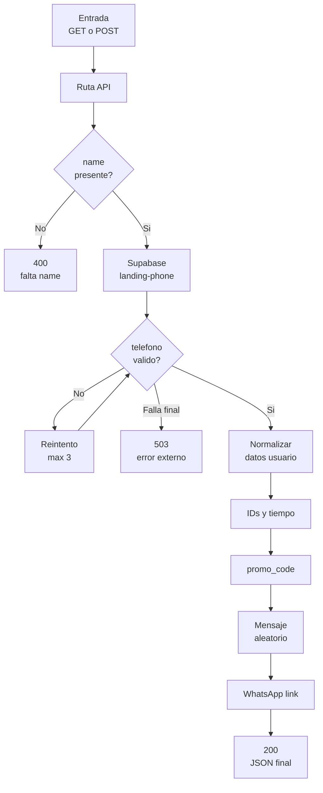

# intermediario-chatrace

Intermediario en Next.js para recibir solicitudes desde Chatrace, pedir un telefono asignado a una funcion externa y devolver un link de WhatsApp con un mensaje automatico que incluye un `promo_code`.

La aplicacion no tiene una interfaz visual relevante: la home solo responde `OK`. El comportamiento principal vive en este endpoint API:

```txt
/api/intermediario-chatrace
```

## Resumen

1. Recibe una solicitud `GET` o `POST`.
2. Lee el parametro obligatorio `name`.
3. Consulta la funcion externa `landing-phone` en Supabase para obtener un telefono asignado.
4. Detecta telefono y email del usuario si vienen en la URL o en el body.
5. Genera `external_id`, `event_id`, `timestamp`, `event_time` y `promo_code`.
6. Arma un link de WhatsApp con un mensaje aleatorio y el `promo_code`.
7. Devuelve todos los datos normalizados en JSON.

## Diagrama de flujo

El diagrama usa etiquetas cortas y saltos de linea para que Mermaid no recorte los textos en modo preview.



## Endpoint

### `GET /api/intermediario-chatrace`

Recibe datos por query string.

```bash
curl "http://localhost:3000/api/intermediario-chatrace?name=Leo&email=leo@example.com&phone=1122334455"
```

### `POST /api/intermediario-chatrace`

Recibe datos por JSON body. El body solo se parsea si el header incluye `Content-Type: application/json`.

```bash
curl -X POST "http://localhost:3000/api/intermediario-chatrace" \
  -H "Content-Type: application/json" \
  -d "{\"name\":\"Leo\",\"email\":\"leo@example.com\",\"phone\":\"1122334455\"}"
```

## Input

El endpoint acepta `GET` y `POST`. Para `GET`, los parametros se leen desde la URL. Para `POST`, se leen desde el body JSON y tambien puede combinarse con query string.

Cuando un dato existe en query string y body, en general tiene prioridad el valor de query string.

### Parametros principales

| Parametro | Alias | Requerido | Formato esperado | Uso |
| --- | --- | --- | --- | --- |
| `name` | - | Si | String no vacio | Se envia a Supabase para pedir el telefono asignado. Tambien se usa para generar el prefijo del `promo_code` si no llega `prefix`/`prefijo`. |
| `external_id` | - | No | Cualquier string | Si llega, se devuelve trimmeado tal como vino. Si no llega, se genera un UUID v4 automaticamente. |
| `prefix` | `prefijo` | No | Letras, numeros, `_` o `-` | Prefijo custom para el `promo_code`. Se sanitiza a minusculas, se eliminan caracteres invalidos y se corta a 20 caracteres. |
| `email` | `em` | No | Email probable | Se normaliza a minusculas. Se devuelve solo si parece email valido. |
| `phone` | `telefono`, `ph` | No | Digitos o texto con digitos | Se normaliza dejando solo digitos. Si tiene 10 digitos, se antepone `54`. Se devuelve solo si queda con al menos 8 digitos. |

### Deteccion automatica

Ademas de los nombres exactos de parametros, el endpoint recorre los valores recibidos en query string y body para detectar automaticamente:

| Dato | Regla |
| --- | --- |
| Email | Cualquier string que cumpla el patron basico `usuario@dominio.ext`. |
| Telefono | Cualquier string/numero que, al quitar caracteres no numericos, quede con al menos 8 digitos. |

Ejemplo: aunque llegue un campo no previsto como `respuesta_1=leo@example.com`, puede terminar saliendo como `email` si pasa la validacion.

### Normalizacion de telefono

| Entrada | Salida |
| --- | --- |
| `1122334455` | `541122334455` |
| `11 2233-4455` | `541122334455` |
| `5491122334455` | `5491122334455` |
| `1234567` | No se devuelve como `phone`, porque tiene menos de 8 digitos. |

### Normalizacion de email

| Entrada | Salida |
| --- | --- |
| `LEO@EXAMPLE.COM` | `leo@example.com` |
| ` leo@example.com ` | `leo@example.com` |
| `leo@example` | No se devuelve como `email`, porque no pasa la validacion basica. |

## Output

### Respuesta `200`

Ejemplo:

```json
{
  "ok": true,
  "log": "ok: entry_received -> constructor_request_ok -> response_mapped",
  "promo_code": "leo-a1b2c3d4e5f6",
  "whatsapp_link": "https://wa.me/5491122334455?text=Hola%21%20Vi%20este%20anuncio...",
  "external_id": "0d8f6a7b-5e3b-4ef9-9c9a-4b38e53c95c1",
  "event_id": "b2f5d9d6-087e-41c6-94e1-6184188b61a5",
  "timestamp": "2026-04-09T19:52:00.000Z",
  "event_time": 1775764320,
  "telefono_asignado": "5491122334455",
  "phone": "541122334455",
  "email": "leo@example.com"
}
```

### Campos de respuesta exitosa

| Campo | Tipo | Siempre viene | Formato / valores | Descripcion |
| --- | --- | --- | --- | --- |
| `ok` | Boolean | Si | `true` | Indica que la solicitud fue procesada correctamente. |
| `log` | String | Si | `ok: entry_received -> constructor_request_ok -> response_mapped` | Log funcional de exito. |
| `promo_code` | String | Si | `{prefijo}-{12_hex}` | Codigo promocional unico generado para la conversacion. |
| `whatsapp_link` | String | Si | `https://wa.me/{telefono}?text={mensaje}` | Link final de WhatsApp con mensaje codificado. |
| `external_id` | String | Si | UUID v4 si no vino en input. Si vino, se devuelve tal cual trimmeado. | Identificador externo de la persona/evento. |
| `event_id` | String | Si | UUID v4 | Identificador unico generado para este evento. |
| `timestamp` | String | Si | ISO 8601 UTC | Fecha/hora generada por el servidor, por ejemplo `2026-04-09T19:52:00.000Z`. |
| `event_time` | Number | Si | Unix timestamp en segundos | Mismo momento que `timestamp`, pero expresado como segundos desde epoch. |
| `telefono_asignado` | String | Si | Solo digitos | Telefono devuelto por Supabase y normalizado. |
| `phone` | String | No | Solo digitos, minimo 8 | Telefono detectado del usuario, si existe y pasa validacion. |
| `email` | String | No | Email en minusculas | Email detectado del usuario, si existe y pasa validacion. |

La respuesta exitosa incluye el header:

```txt
Cache-Control: no-store, no-cache, must-revalidate, proxy-revalidate
```

## Logs

El campo `log` puede tomar estos valores/formas:

| Caso | HTTP | `ok` | `log` |
| --- | --- | --- | --- |
| Exito | `200` | `true` | `ok: entry_received -> constructor_request_ok -> response_mapped` |
| Falta `name` | `400` | `false` | `entry.validation_error: falta el parametro requerido name` |
| Error procesando o consultando telefono | `503` | `false` | `constructor.request_error: {mensaje}` |

Ejemplos posibles de `constructor.request_error`:

```txt
constructor.request_error: No fue posible obtener telefono luego de reintentos: Timeout consultando landing-phone (6000ms)
constructor.request_error: No fue posible obtener telefono luego de reintentos: landing-phone respondio 500
constructor.request_error: No fue posible obtener telefono luego de reintentos: No se pudo obtener un telefono valido
```

## Promo Code

Formato:

```txt
{prefijo}-{segmento_uuid}
```

Reglas:

1. Si llega `prefix` o `prefijo`, se usa ese valor sanitizado.
2. Si no llega prefijo custom, se usan las primeras 3 letras del `name` sanitizado.
3. Si no hay ningun valor usable, se usa `usr`.
4. El segmento final son los primeros 12 caracteres hexadecimales de un UUID sin guiones.

Ejemplos:

```txt
name=Leo              -> leo-a1b2c3d4e5f6
name=Juan             -> jua-a1b2c3d4e5f6
name=Juan&prefix=ads  -> ads-a1b2c3d4e5f6
```

El prefijo se sanitiza asi:

| Entrada | Prefijo resultante |
| --- | --- |
| `Ads-01` | `ads-01` |
| ` Promo 2026! ` | `promo2026` |
| `abc_def` | `abc_def` |
| `prefijo-muy-largo-1234567890` | `prefijo-muy-largo-12` |

## WhatsApp

El mensaje no es siempre el mismo. El codigo tiene varias frases posibles y elige una aleatoriamente en cada request.

El `promo_code` siempre se agrega al final del mensaje si existe.

Ejemplo:

```txt
Hola! Vi este anuncio, me pasas info? leo-a1b2c3d4e5f6
```

El link final se genera con este formato:

```txt
https://wa.me/{telefono_asignado}?text={mensaje_codificado}
```

## Errores

### Falta `name`

Respuesta `400`:

```json
{
  "ok": false,
  "error": "Falta el parametro \"name\"",
  "log": "entry.validation_error: falta el parametro requerido name"
}
```

### Falla consultando telefono asignado

Respuesta `503`:

```json
{
  "ok": false,
  "error": "No fue posible obtener telefono luego de reintentos: ...",
  "log": "constructor.request_error: ..."
}
```

## Servicio externo

El endpoint consulta esta funcion externa:

```txt
https://fdkjkzpjqfbaavylapun.supabase.co/functions/v1/landing-phone
```

La llama con:

```txt
?name={name}&source=chatrace
```

Configuracion actual:

| Ajuste | Valor |
| --- | --- |
| Metodo | `GET` |
| Timeout | `6000ms` |
| Reintentos | `3` |
| Backoff | `400ms * numero_de_intento` |
| Cache | `no-store` |
| Header | `Accept: application/json` |

El telefono asignado puede venir desde cualquiera de estas claves de la respuesta externa:

```txt
number
phone
telefono
telefono_asignado
data.number
data.phone
```

Luego se normaliza con las mismas reglas de telefono: solo digitos y prefijo `54` si queda con 10 digitos.

## Desarrollo local

Instalar dependencias:

```bash
npm install
```

Levantar el servidor:

```bash
npm run dev
```

Probar la home:

```txt
http://localhost:3000
```

Probar el endpoint:

```txt
http://localhost:3000/api/intermediario-chatrace?name=Leo
```

## Scripts

```bash
npm run dev
npm run build
npm run start
```

## Deploy

El proyecto esta configurado para Vercel como app Next.js. La configuracion esta en `vercel.json`.
