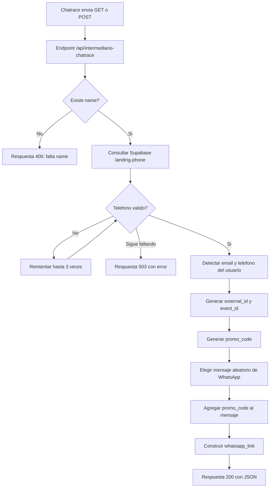

# intermediario-chatrace

Intermediario en Next.js para recibir solicitudes desde Chatrace, pedir un telefono asignado a una funcion externa y devolver un link de WhatsApp con un mensaje automatico que incluye un `promo_code`.

La aplicacion no tiene una interfaz visual relevante: la home solo responde `OK`. El comportamiento principal vive en el endpoint API:

```txt
/api/intermediario-chatrace
```

## Que hace

1. Recibe una solicitud `GET` o `POST`.
2. Lee el parametro obligatorio `name`.
3. Consulta la funcion externa `landing-phone` en Supabase para obtener un telefono asignado.
4. Detecta telefono y email del usuario si vienen en la URL o en el body.
5. Genera un `promo_code` unico.
6. Arma un link de WhatsApp con un mensaje aleatorio y el `promo_code`.
7. Devuelve todos los datos normalizados en JSON.

## Diagrama de flujo



## Endpoint

### `GET /api/intermediario-chatrace`

Ejemplo:

```bash
curl "http://localhost:3000/api/intermediario-chatrace?name=Leo&email=leo@example.com&phone=1122334455"
```

### `POST /api/intermediario-chatrace`

Ejemplo:

```bash
curl -X POST "http://localhost:3000/api/intermediario-chatrace" \
  -H "Content-Type: application/json" \
  -d "{\"name\":\"Leo\",\"email\":\"leo@example.com\",\"phone\":\"1122334455\"}"
```

## Parametros aceptados

| Parametro | Requerido | Descripcion |
| --- | --- | --- |
| `name` | Si | Nombre usado para pedir el telefono asignado y generar el prefijo del `promo_code`. |
| `external_id` | No | ID externo. Si no se envia, se genera uno automaticamente. |
| `prefix` | No | Prefijo custom para el `promo_code`. |
| `prefijo` | No | Alias en espanol de `prefix`. |
| `email` / `em` | No | Email del usuario. Tambien puede detectarse desde otros valores enviados. |
| `phone` / `telefono` / `ph` | No | Telefono del usuario. Tambien puede detectarse desde otros valores enviados. |

## Respuesta exitosa

Ejemplo de respuesta `200`:

```json
{
  "ok": true,
  "log": "ok: entry_received -> constructor_request_ok -> response_mapped",
  "promo_code": "leo-a1b2c3d4e5f6",
  "whatsapp_link": "https://wa.me/5491122334455?text=Hola%21%20Vi%20este%20anuncio...",
  "external_id": "0d8f6a7b-5e3b-4ef9-9c9a-4b38e53c95c1",
  "event_id": "b2f5d9d6-087e-41c6-94e1-6184188b61a5",
  "timestamp": "2026-04-09T19:52:00.000Z",
  "event_time": 1775764320,
  "telefono_asignado": "5491122334455",
  "phone": "541122334455",
  "email": "leo@example.com"
}
```

## Mensajes de WhatsApp

El mensaje no es siempre el mismo. El codigo tiene varias frases posibles y elige una aleatoriamente en cada request.

El `promo_code` siempre se agrega al final del mensaje si existe. Ejemplo:

```txt
Hola! Vi este anuncio, me pasas info? leo-a1b2c3d4e5f6
```

El link final se genera con este formato:

```txt
https://wa.me/{telefono_asignado}?text={mensaje_codificado}
```

## Como se genera el promo_code

Formato:

```txt
{prefijo}-{segmento_uuid}
```

Reglas:

1. Si llega `prefix` o `prefijo`, se usa ese valor sanitizado.
2. Si no llega prefijo custom, se usan las primeras 3 letras de `name`.
3. Si no hay ningun valor usable, se usa `usr`.

Ejemplos:

```txt
name=Leo              -> leo-a1b2c3d4e5f6
name=Juan             -> jua-a1b2c3d4e5f6
name=Juan&prefix=ads  -> ads-a1b2c3d4e5f6
```

## Errores

Si falta `name`, responde `400`:

```json
{
  "ok": false,
  "error": "Falta el parametro \"name\"",
  "log": "entry.validation_error: falta el parametro requerido name"
}
```

Si falla la consulta al telefono asignado despues de los reintentos, responde `503`:

```json
{
  "ok": false,
  "error": "No fue posible obtener telefono luego de reintentos: ...",
  "log": "constructor.request_error: ..."
}
```

## Servicio externo

El endpoint consulta esta funcion externa:

```txt
https://fdkjkzpjqfbaavylapun.supabase.co/functions/v1/landing-phone
```

La llama con:

```txt
?name={name}&source=chatrace
```

Tiene timeout de 6 segundos y hasta 3 intentos con espera incremental.

## Desarrollo local

Instalar dependencias:

```bash
npm install
```

Levantar el servidor:

```bash
npm run dev
```

Probar la home:

```txt
http://localhost:3000
```

Probar el endpoint:

```txt
http://localhost:3000/api/intermediario-chatrace?name=Leo
```

## Scripts

```bash
npm run dev
npm run build
npm run start
```

## Deploy

El proyecto esta configurado para Vercel como app Next.js. La configuracion esta en `vercel.json`.
